# Linux 中的 GuardMiner 挖矿脚本分析

init.sh是整个挖矿脚本的开始，它的作用是用于下载挖矿程序本体以及挖矿程序的配置文件。

## init.sh脚本分析

程序开始，该脚本首先关闭了Linux的SELINUX防火墙程序，接着就复制了linux中的curl和wget，然后就利用复制下来的程序下载东西。

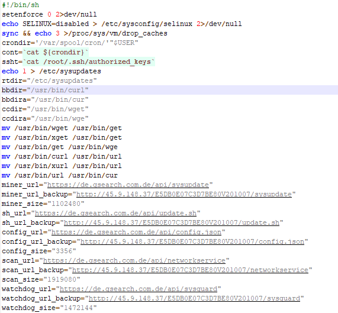

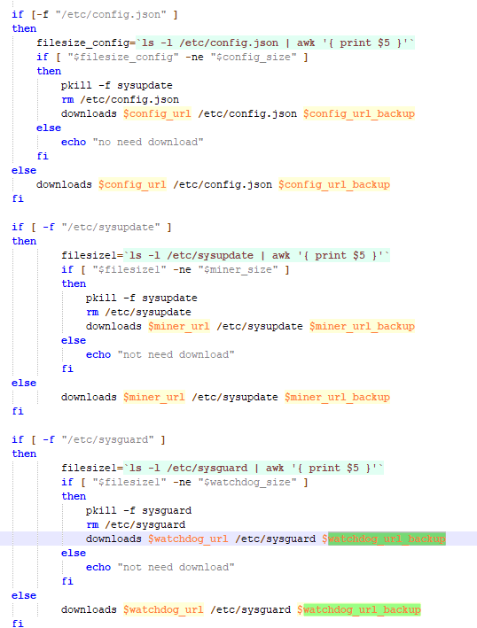

这里下载了5个文件，分别是`sysupdate`,`update.sh`,`config.json`,`networkservice`,`sysguard`。

接下来就是对于竞争挖矿程序的清除。

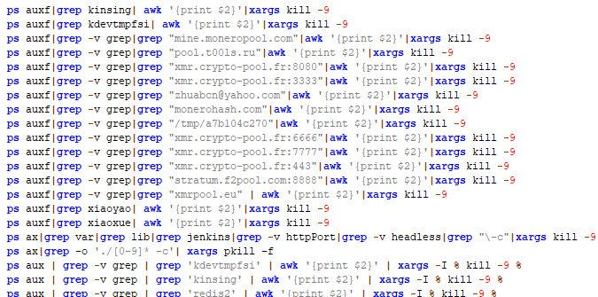

不仅如此，该脚本还把CPU占用率超过40以上的其他程序全部杀死。

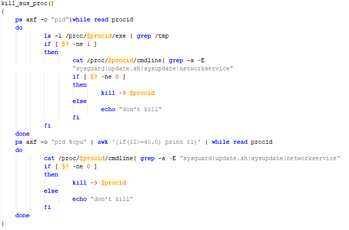

**权限维持**

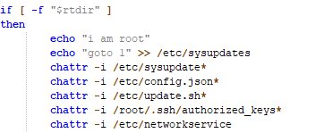

从这部分可以看出，这个脚本之前下载的一些文件全部打上权限，保持了这些文件的可用性。

添加定时任务。

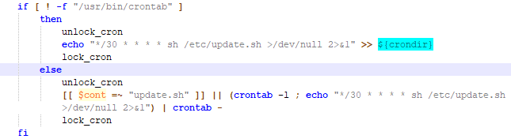

添加ssh密钥。

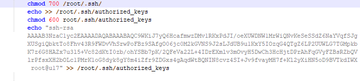

为挖矿程序开放端口。

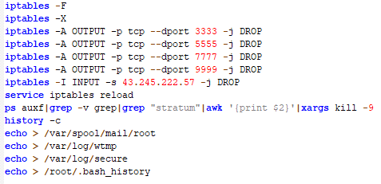

## newdat.sh脚本分析

脚本开头和init.sh差不多，只不过多了卸载阿里云和百度云的监控，关闭ufw，清除iptables，并使看门狗失效。

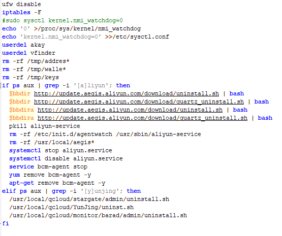

其余操作和init.sh脚本文件类似，在newdat.sh脚本的末尾，它下载了名为spre.sh的脚本文件。

## spre.sh脚本分析

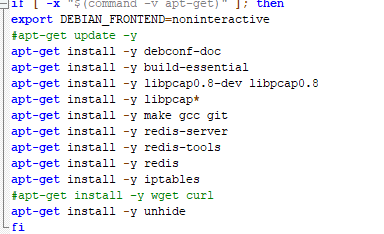

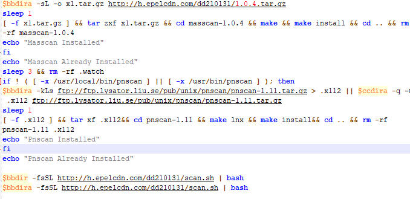

这个脚本的目的就是为了安装各种工具，来为下一个脚本的横向移动提供便捷。

## scan.sh脚本分析

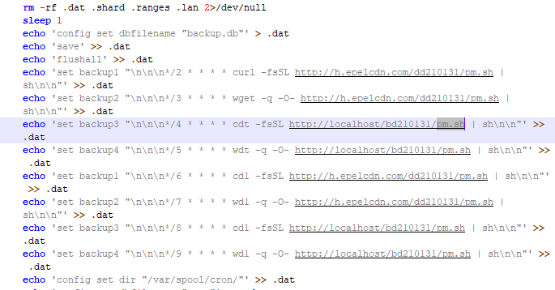

这边添加了一堆pm.sh到定时任务中，但是检索之前所有的脚本来看，并没有派上什么用场，估计是作者用来混淆视听的作用。

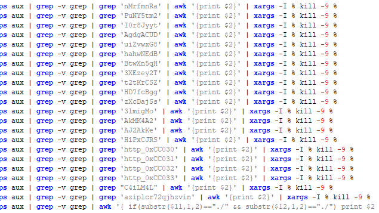

这里可以看到该脚本正在利用redis弱口令取得权限来进行做横向移动来感染更多的目标。

# 解决方案

专杀脚本

https://github.com/G4rb3n/Botnet-Zoo/blob/main/GuardMiner/2103/killer/guardminer.sh
