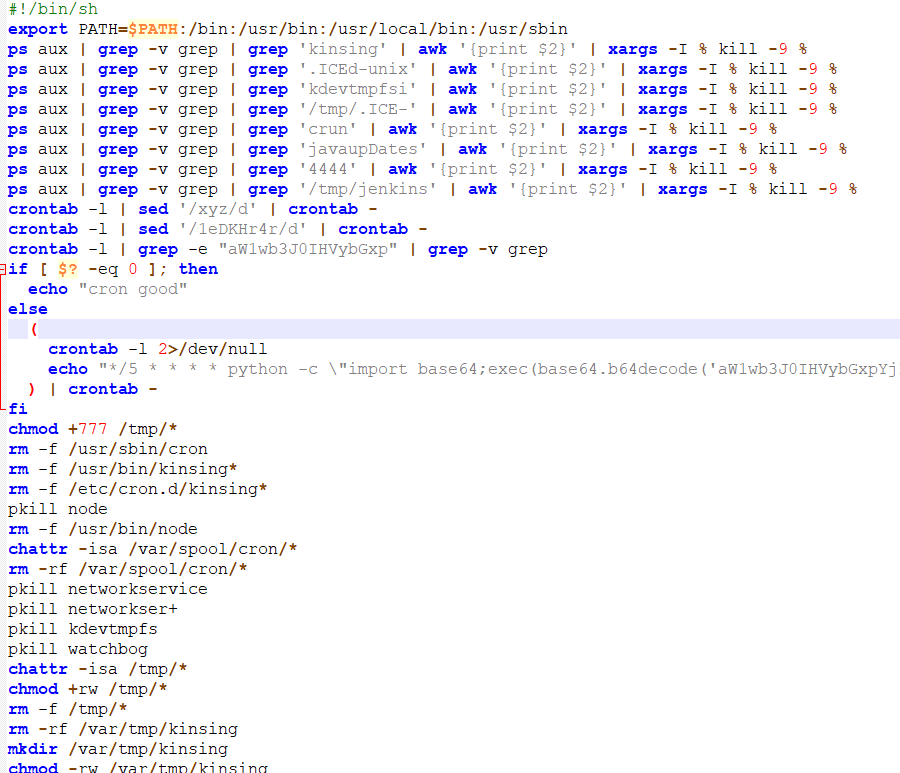
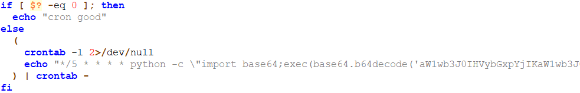
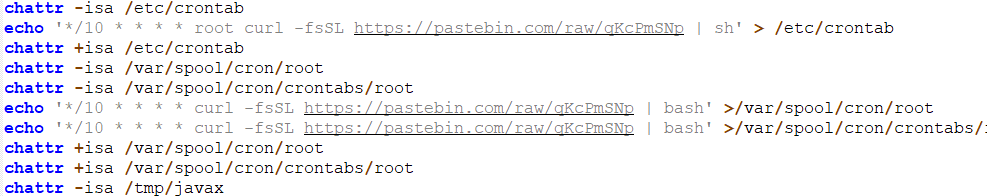
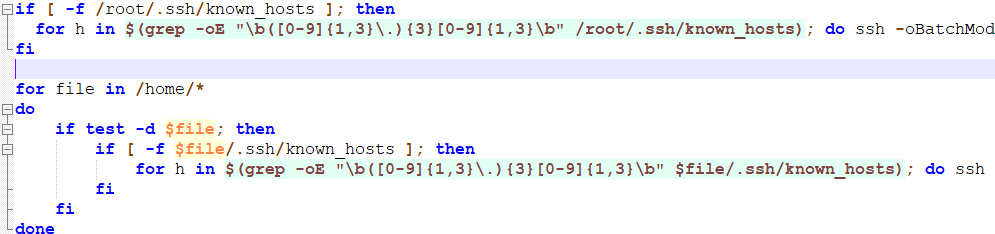
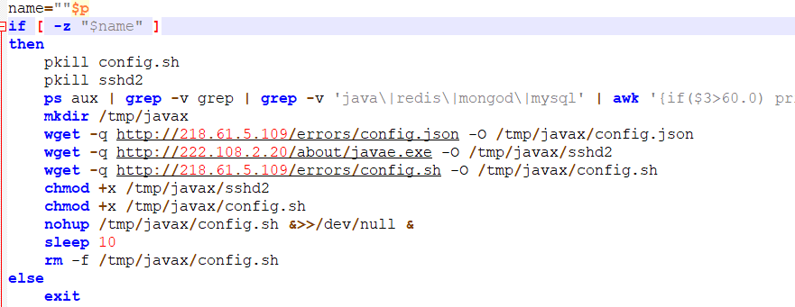

# Z0Miner

代码先通过匹配文件名和进程，来清除掉其他匹配到的挖矿木马的进程和文件。

安装了crontab定时任务，定时下载木马和shell脚本到失陷的机器上运行。

通过SSH远程登录认证后的机器，执行远程命令。

下载了javae.exe config.json config.sh程序，通过config.sh启动挖矿。在后台运行config.sh程序，忽略config.sh文件，然后终止代码。

