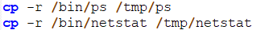
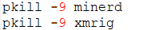
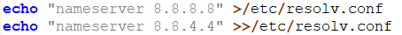
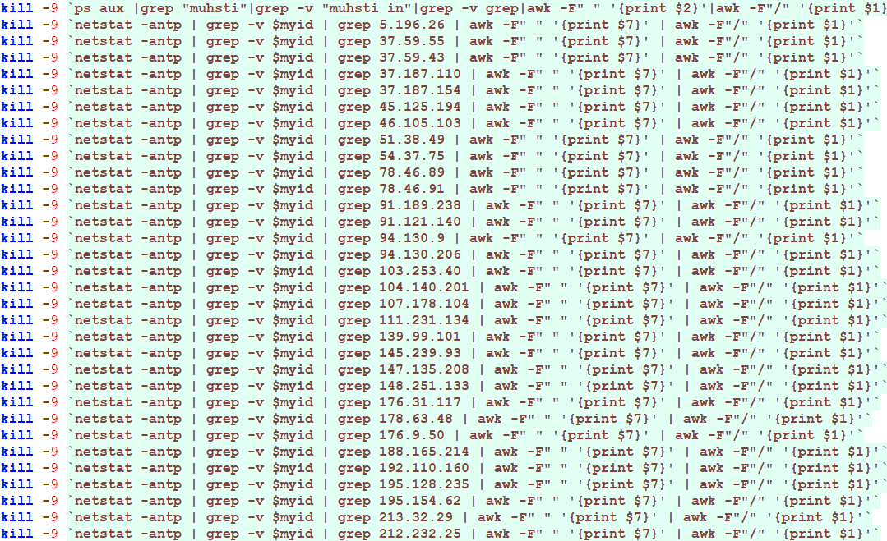
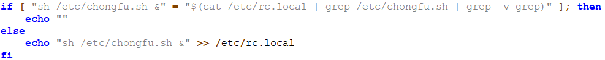
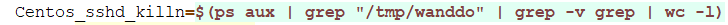
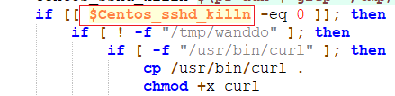
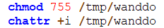
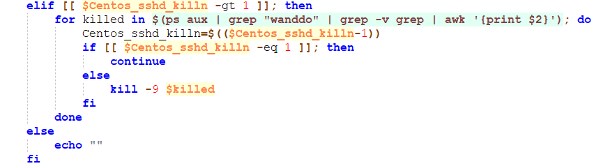

# chongfu挖矿木马分析

递归 复制目录

杀掉比特币，门罗币挖矿程序

配置DNS域名

杀掉匹配的相关IP

判断有没有开机启动程序（rc.local），如果没有就写入开机自启动程序

找wanddo有多少，杀掉多余的，防止启动多个

如果上面的命令(Centos_sshd_killn)执行成功，则开始执行下面的命令

文件(/tmp/wanddo)如果存在则把
文件(/usr/bin/curl)复制并给执行权限

把输出写入文件中并允许curl使用非安全的ssl连接并且传输数据（证书不受信）

设置该文件除了文件所有者，其他用户无法写，只有读和执行权限。并防止改文件(/tmp/wanddo)被修改。

删除复制出来的curl，结束该if判断。

如果命令($Centos_sshd_killn)返回值大于1，则杀掉多余的命令。如果命令参数等于1则继续，否则无条件终止进程。

# 简单解决步骤：

1. 清除自动启动脚本 
vim /etc/rc.local  去掉 sh /etc/chongfu.sh &
2. 清除 脚本 
rm -rf /etc/chongfu.sh  /tem/chongfu.sh   /tmp/wanddo
3. 修改登录密码
4. 重启。
