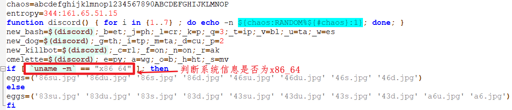
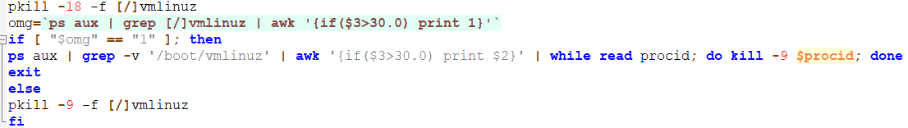
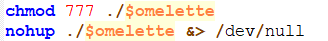
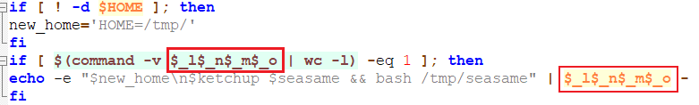
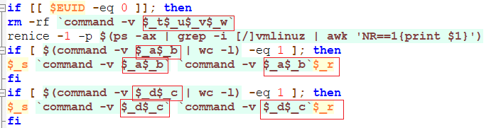
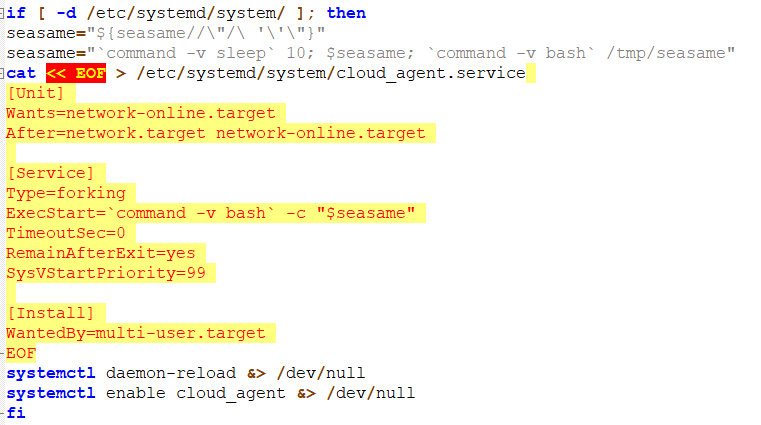
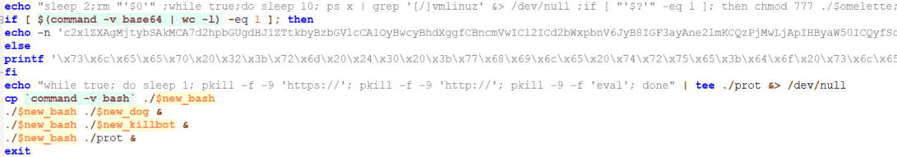

# seasame挖矿木马分析

entropy为翻转后的C$C服务器地址，后面描述文件时，变量new_bash、new_dog、new_killbot、omelette是后面会要创建的文件名，并且是随机字符串组成的。

查看存不存在vmlinuz进程和CPU占用有没有超过百分之30，来判断是否成功感染，如果感染了就杀掉CPU超过百分之30以上的进程。

杀掉所有含prot的进程,下载挖矿程序omelette和脚本母体seasame。并且开始执行挖矿程序。

修改文件(omelette)为可读可写可执行,并不断运行该文件。

创建crontab定时任务。

删除了iptables，并把wget改为wgetak,把curl改为了curlak。

创建云代理服务,用来下载和执行母体脚本seasame。

将bash命令复制在当前目录，之后执行new_dog:保护挖矿进程；new_killbot:杀掉除了vmlinuz之外，占用CPU超过百分之30的进程；port:杀掉含有https://、http://、eval的进程。

# 简单的解决方法

- 删除 /usr/bin/wgetak 文件
- crontab -e 命令删除对应的定时任务
- 继续删除 /tmp 下所有文件，kill 进程
- grep "wgetak" /etc/ -nri
搜索包含wgetak的文件，文件伪装成类似阿里的后台云监控服务名，删除后重启。