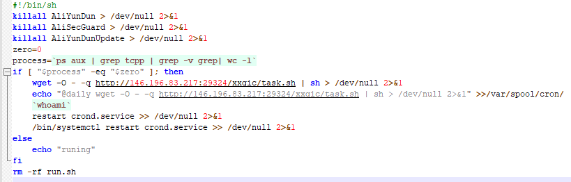
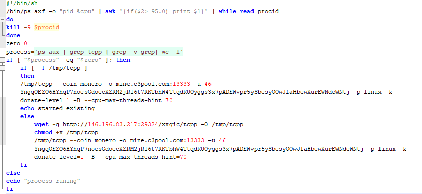

# RunMiner挖矿木马

主程序`run.sh`

程序刚开始，它不管三七二十一直接删除阿里云的安全防护。

然后开始在进程中查询，是否存在`tcpp`的进程，如果不存在就开始下载`task.sh`文件，并在定时任务中添加定期下载的任务。

最后就把自身这个程序删除。

接着再来看看`run.sh`所下载的`task.sh`文件。

这个文件可以看出来是运行挖矿程序的主要脚本。

在程序的一开始，它检查系统的cpu资源占用，杀掉占用率超过95%的程序。

然后还是在进程中检查是否存在`tcpp`进程。存在就直接运行，不存在就是先在`http://146.196.83.217:29324/xxgic`下载，然后赋予权限之后开始运行挖矿。

至此，RunMiner挖矿木马分析已经结束。
