# 彩虹猫病毒样本的分析
最近对病毒源文件比较感兴趣,找了个彩虹猫的病毒源文件来进行分析。

**病毒分析环境的详细介绍**
```
    样本名称：MEMZ.exe
    MD5： 29550773947d03404b109ab6b808e5c4
    SHA1： 2413714dc7373eeb5f39ba952b6b2be4544cfdf6
    实验平台：windows7
    实验工具：LordPE,PEiD v0.95,IDA x32 v7.5,VMWare WorkStation v15.5.6
```
## 运行过程
先在虚拟机上尝试运行查看触发的流程之间会出现一些较为不寻常的现象,
运行结果如图:
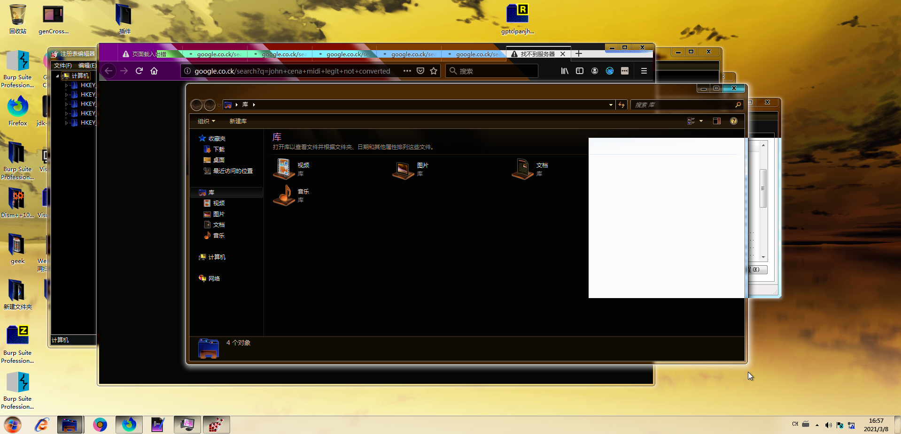
例如:
- 两个提醒弹窗和一个文档
- 连续跳出多个浏览器的搜索界面
- 鼠标出现莫名晃动且移动时出现异常图标
- 屏模颜色出现变化,连续出现系统提示音
- 在任务管理器中发现出现了6个`MEMZ.exe`进程

出现了这六个MEMZ.exe进程后,当用户尝试关闭任意一个或者进行系统重启时,都会遭到大量的弹窗以至最后蓝屏,之后windows将无法启动,之后屏幕上只会一直循环播放一只带有背景音乐的彩虹猫在哪里上下浮动。
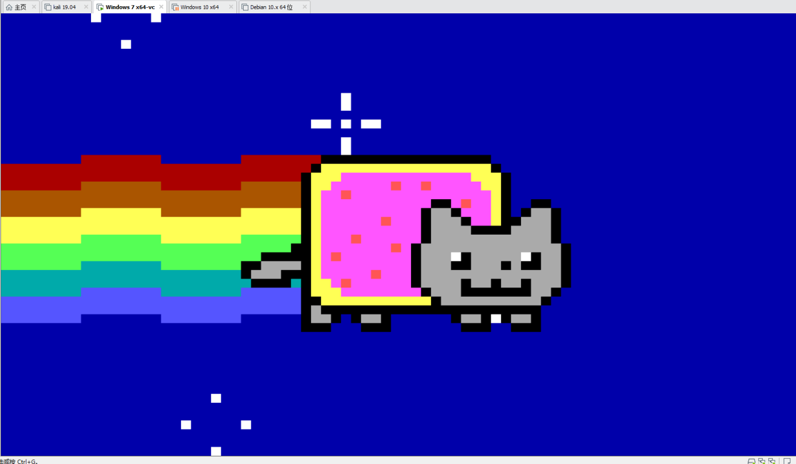

## 进行分析
**PEiD和LordPE分析**
现在开始分析,先进行查壳,看是否存在加密或者壳,如果有的话就得需要我们脱壳了。
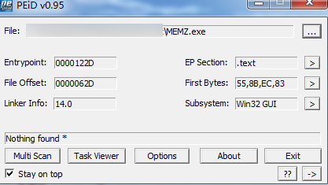

接着我们用LordPE来查看这个病毒样本的导入表,分析API,查看其中一些关键的敏感函数。
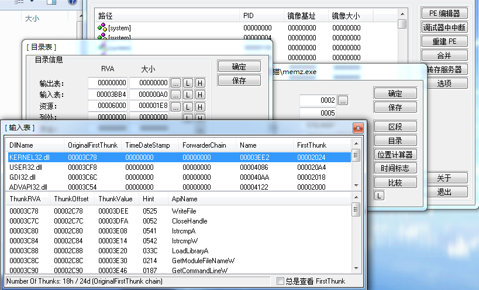
如下:
- 自动弹出多个浏览器窗口 `ShellExecute`
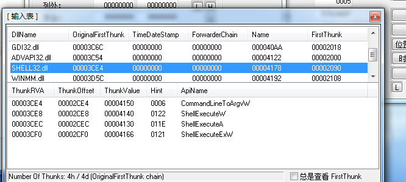

- 发出系统提示音 `PlaySoundA`
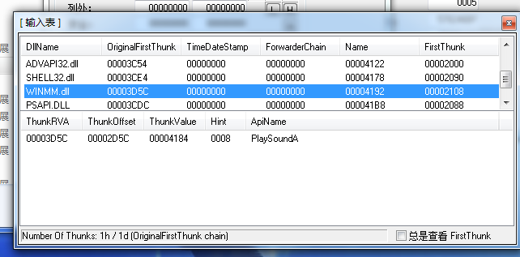

- 桌面颜色变化异常 `BitBlt`、`StretchBit`
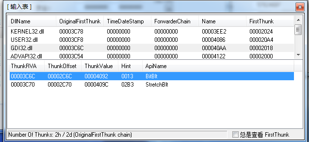

- 鼠标异常晃动 `SetCursorPos`、`GetCursorPos`
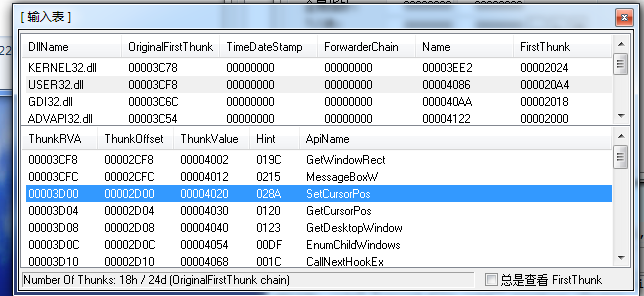

- 鼠标移动时桌面出现奇怪图标 `DrawIcon`
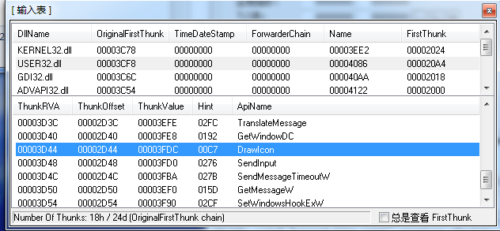

- 出现6个MEMZ进程 `ShellExecute`
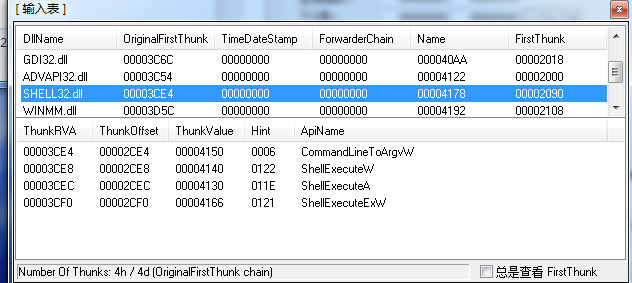

还能发现一些虽然不能直接关联，但常常成对出现并且能完成某些功能。
```
    OpenProcessToken、AdjustTokenPrivilege、LookUpPrivilegeValue--------给进程提权
    GetMessage、TranslateMessage、DispatchMessage-----------------------建立消息循环
    CreateToolhelp32Snapshot、Process32First、Process32Next-------------遍历进程
    SetWindowHookEx、UnhookWindowHookEx、CallNextHookEx-----------------给窗口下钩子
    LoadLibrary、GetProcAddress-----------------------------------------加载库并导入函数
```

## IDA分析
用IDA32打开MEMZ.exe,定位到入口函数start并且使用快捷键F5来获取伪代码,这功能能有效的提高我们对样本分析的效率。但有一点要记住这些伪代码只是IDA通过现有的信息来生成(也可以说是猜)出来的,并不能保证其百分之百的正确,有时也会影响我们的分析过程。
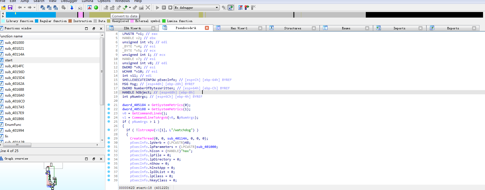
由上图我们可知:用start函数进入,首先调用 `GetCommandLine`和`CommandLineToArgv`两个函数来获取命令行参数。


**无参部分--**
当程序无参数时,使用MessageBox()函数弹出两个名为MEMZ弹窗——刚执行时出现的两个确认窗口：
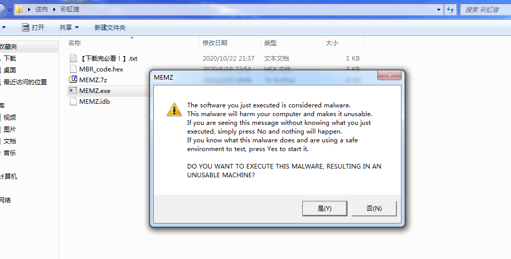

当这两次弹窗确认后,将获取进程的路径并存入`v10`中,接下来的`do while`执行5次循环,并且每次循环都调用一次`ShellExecuteW`,从而生成5个相同的进程,参数为`watchdog`:
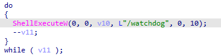
5次循环结束后,用`ShellExecute`函数生成一个参数为`main`的进程,接下来的`SetPriorityClass`是给进程设置优先级的函数,多半是用来提权的,并且该函数的参数为`0x80u`,这也就意味着该`/main`进程的优先级应该是最高的。
经过这一系列分析,我们终于知道在运行过程中的6个`MEMZ.exe`是怎么来的了,由最开始的双击从而生成一个原始进程,之后原始进程生成了5个`/watchdog`进程和一个`/main`进程,之后原始进程就第一时间将自己干掉,因此这就是为什么我们打开任务管理器时,存在6个`MEMZ.exe`进程的原因了。


**有参数的部分--watchdog**

程序对参数的判断有两个:一为`watchdog`,一为`main`。
判断获取的参数是否为`watchdog`,是则向下执行,之后则调用`CreateThread`来创建线程。
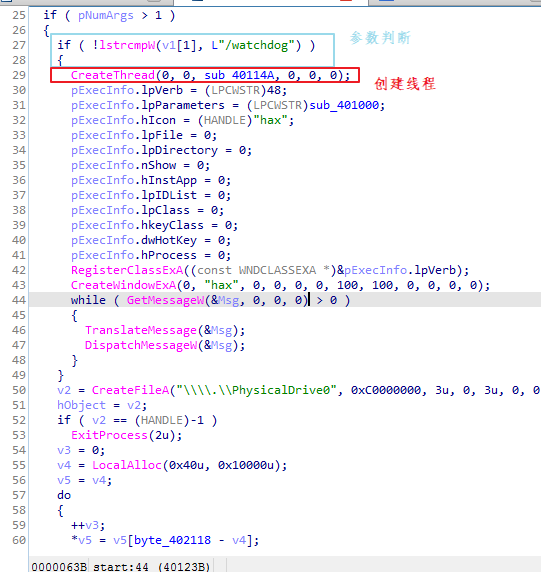


***sub_40114A函数***

在该函数中,首先调用 `GetCurrentProcess` 和 `GetProcessImageFileName` 函数来获取此执行文件的路径,之后进入死循环中。在此循环中,`CreateToolhelp32Snapshot`用于拍摄进程快照,`Process32First`、`Process32Next`用于遍历进程,`GetProcessImageFileName`用于获取进程路径:
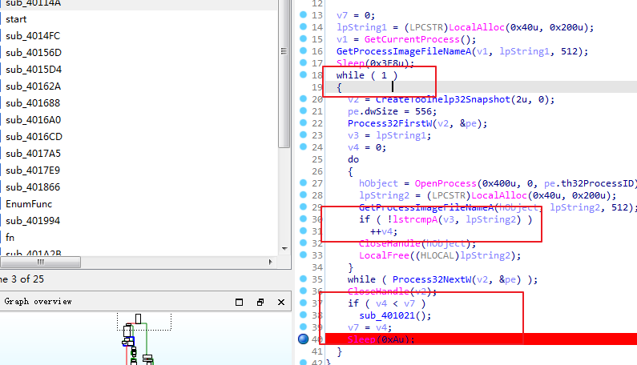
在这上图中我们可以看出这几个点:

- while循环是永真循环(死循环);
- 这个循环会比较其中的两个变量;
- 如果相同的话,其中v4会自增;
- 如果是`v4>v7`的话,就会进入另一个函数;
- v4每次循环都会重置0;
- V7每次循环都会被赋值v4的值;

我们在之前运行`彩虹猫`时,其过程中会生成6个`MEMZ.exe`的进程,并且当我们强制关闭一个进程时就会蓝屏,由此可知,上面这部分的大概意思就是检测进程数,一旦进程数小于6个的话,就会触发下面的`sub_401021`函数,使之蓝屏。


***sub_401000***

在此函数中我们可以看到其对`Msg`进行了一个判断:其一为`16`,对应了`WM_CLOSE`WM_CLOSE;其二22则对应了`WM_ENDSESSION`。当其取值符合时，则跳转到`sub_401021`函数并触发蓝屏关机,相反则由`DefWindowProc`这个默认的窗口处理函数来进行操作(即不处理)。


***sub_401021***

之后我们继续看`sub_401021`函数,一进来我们就看到`RtlAdjustPrivilege`和`NtRaiseHardError`,这两个放在一起的话就是个经典的蓝屏手段,前者提权后者使之蓝屏。
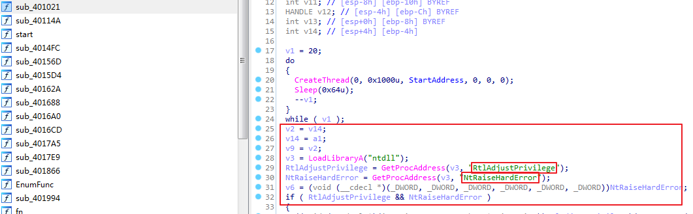
我们还能在其中看到:

- `GetCurrentProcess`和`OpenProcessToken`-------用于打开进程ToKen
- `LookupPrivilegeValueW`-----------------------查看系统权限的特权值
- `AdjustTokenPrivileges`-----------------------指定访问令牌的权限

所以我们能推断,在`sub_40114A`函数中调用`sub_401021`函数就是为了在判断进程出减少时(强制停止MEMZ.exe进程),从而控制系统蓝屏。

到这里,因本人的技术有限只能分析到这了,但它其中还有许多可以深究的地方,之后也可以在此病毒的基础上进行修改,例如其中的GIF,配音等等，这些操作等本人技术有所提升后再来实现。


                                                                                    待续<<<


