# APK逆向分析
WannaCry是一种“蠕虫式”勒索病毒软件，由不法分子利用NSA泄露方程式工具包的危险漏洞“EternalBlue”(永恒之蓝)进行传播。该蠕虫感染计算机后会向计算机中植入敲诈者病毒，导致电脑大量文件被加密。
# WannaCry的初步分析
```
    病毒分析环境的详细介绍
    样本名称：wcry.exe
    MD5：84c82835a5d21bbcf75a61706d8ab549
    SHA1：5ff465afaabcbf0150d1a3ab2c2e74f3a4426467
    SHA256：ed01ebfbc9eb5bbea545af4d01bf5f1071661840480439c6e5babe8e080e41aa
    实验平台：wind7
    实验工具：LordPE,PEiD v0.95,IDA x32 v7.5,VMWare WorkStation v15.5.6
```

## 运行过程
当我们运行wcry.exe文件后,运行结果如图:

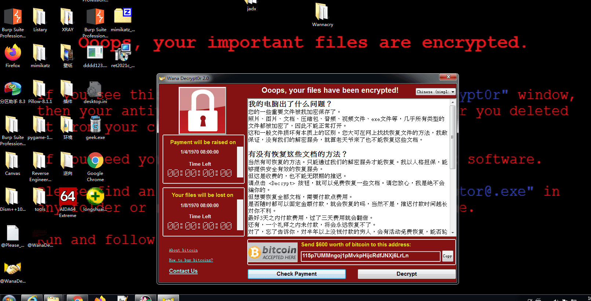

这时我们会发现,我们系统中的图片、视频、音频、压缩包等等几乎所有类型的文件都被加密了,后缀名都被修改为`wnry`并且该勒索软件会将`@WanaDecryptor@.exe`复制到加密文件夹下,并衍生大量语言配置文件、具有加密功能的文件、窗体文件等。这个文件曾被认为是U盘传播的恶意代码，但实际上这个程序只是勒索程序的界面程序，并没有传播、加密等恶意功能。

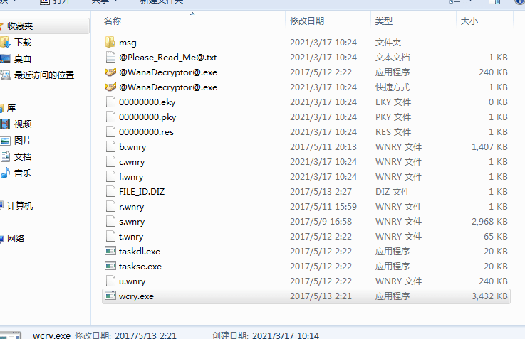

**WannaCry运行的整体流程框架图**

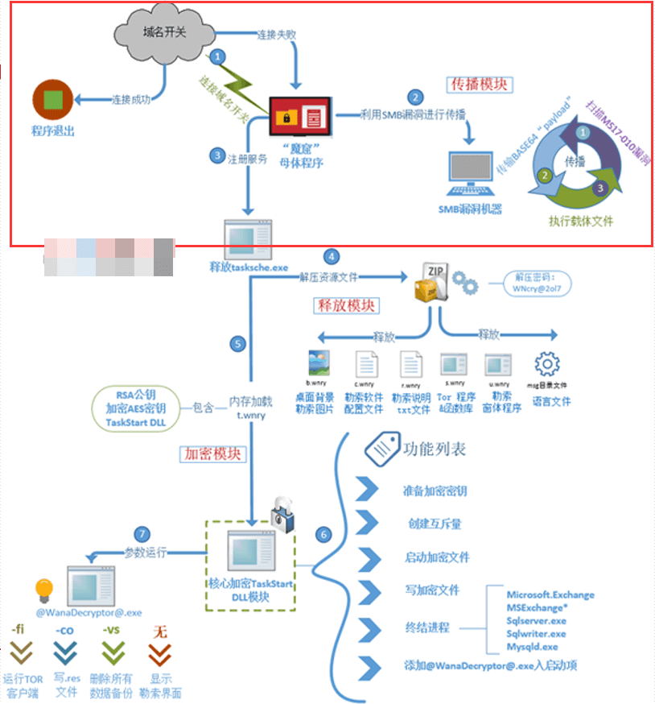

- 主程序文件利用漏洞传播自身,运行`WannaCry`勒索程序
- `WannaCry`勒索程序释放`ksche.exe`,对磁盘文件进行加密勒索
- `@WanaDecryptor`显示勒索信息,解密示例文件
其中上半部分为`WannacRY`蠕虫的传播部分,该蠕虫通过网络进行传播,有自我复制和传播迅速等特点。传播步骤如下:
- 连接远程域名
- 安装并启动服务
- 建立局域网或公网IP表,为每个IP依次创建线程
- 尝试连接`445`端口,测试是否存在`SMB`漏洞
- 如果存在漏洞,则发送包含动态库的`Payload`进行攻击
- 执行`shellcode`并使用`APC注入`将生成的`dll`注入到进程`lsass.exe`中
- `dll`调用导出函数PlayGame,释放资源文件并保存为`mssecsvc.exe`执行,释放勒索程序`tasksche.exe`
- 被攻击继续使用`MS17-010`漏洞进行传播

## 基础分析

**基础静态**
日常第一步用`PEID`查壳:

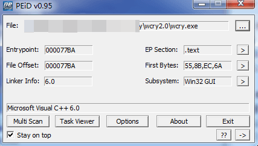

之后用`PEID`的插件`Krypto ANALyzer`来进行分析

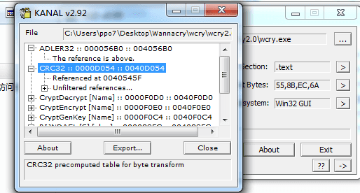

之后我们再用`LordPE`来查看它的输入表:

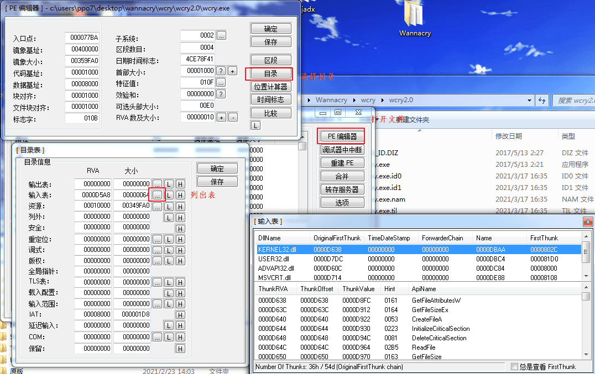

我们在`KERNEL32.dll`中可以看到该病毒对目标机器中的资源和文件进行了操作

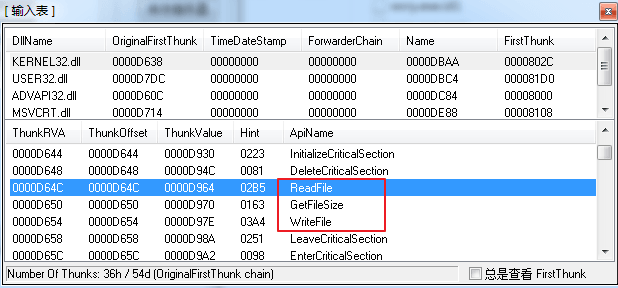

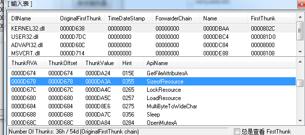

我们用`010`或者用`Resource Hacker`打开查看该文件发现其文件头为`PK`

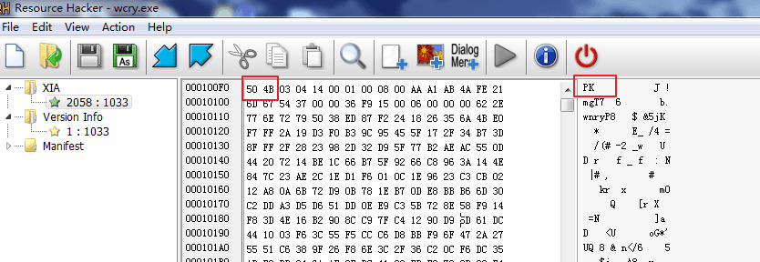

我们以压缩包格式打开改`wcry.exe`文件发现:

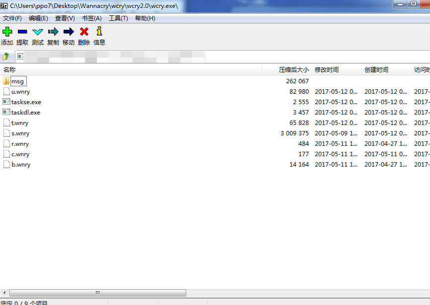

其中文件的作用如下:
```
    b.wnry      //桌面背景图片
    c.wnry      //配置文件，包含洋葱域名、比特币地址、tor下载地址等
    msg/*.wnry  //各个不同的语言包
    r.wnry      //@Please_Read_Me@.txt
    s.wnry      //是压缩文件，打包的是Tor相关组件
    taskdl.exe  //删除回收站文件
    taskse.exe  //用于启动其他session的@WanaDecryptor@.exe
    u.wnry      //@WanaDecryptor@.exe解密器
    t.wnry      //测试文件(解密后是加密器)
```

**动态分析**
我们先用火绒剑在该文件运行时进行分析,我们可以看到,在该病毒文件启动任务时,目标机器会每搁一段时间就会运行主程序`@WanaDecryptor@.exe`文件,之后便会自动退出。

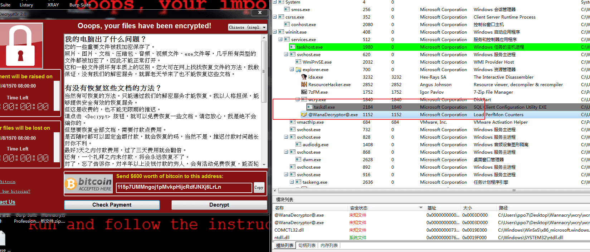

我们继续用火绒剑进行分析,查看文件,我们发现这个病毒用我们电脑上自带的文件创建了许多新的文件,并且文件被加密后后缀名也被更改为了`WNCRYT`,

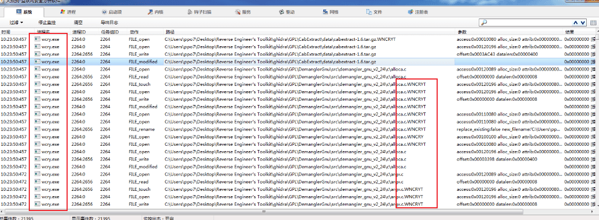

我们在打开火绒剑时运行该`wcry.exe`文件查看进程时会发现该病毒会创建4个子进程,并且其中一个还是用`cmd.exe`来执行的一个脚本文件。

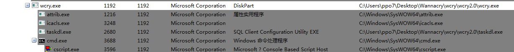

之后我们继续查看发现其注册表中也发生了修改,但其的修改操作则不多,在`HKEY_LOCAL_MACHINE\SOFTWARE`中新加了一个键,并且把病毒文件的路径加到了里面。`HKEY_LOCAL_MACHINE\SOFTWARE\Wow6432Node\WanaCrypt0r`

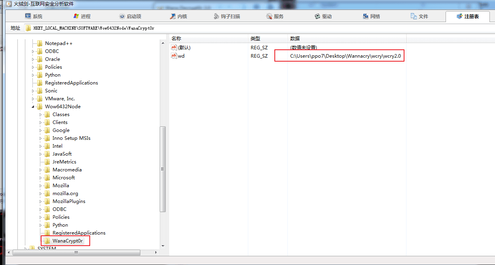


该篇所包含的内容较多,所需分析的东西很多,难度较高,并且本人技术还未达标,所以之后的一些分析会在本人技术提升到一定程度时会继续将此篇文章补全。