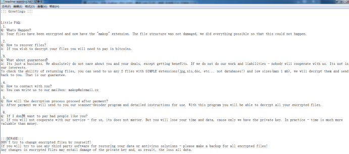
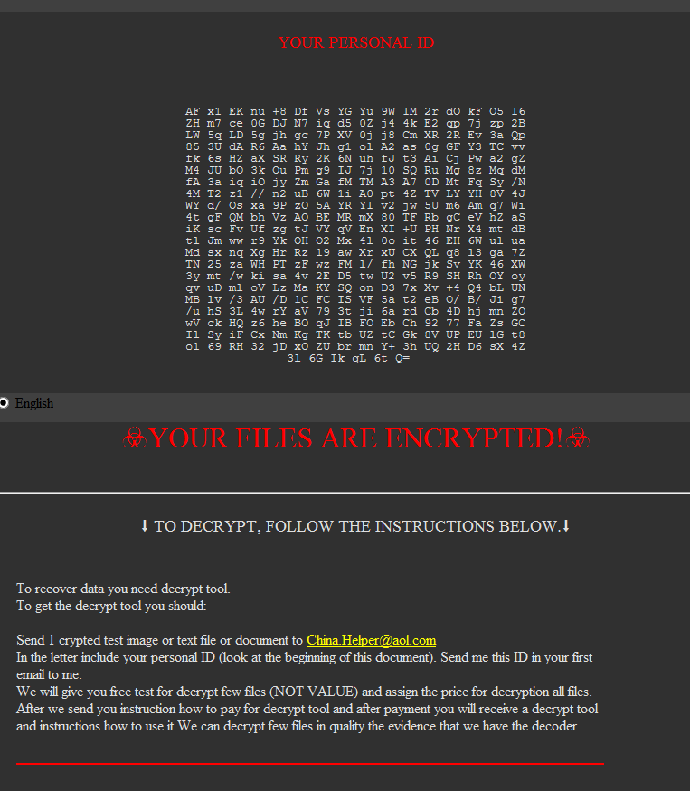
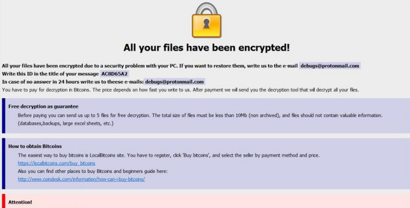
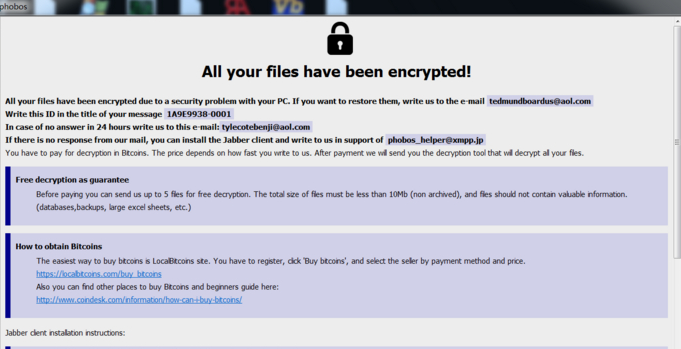
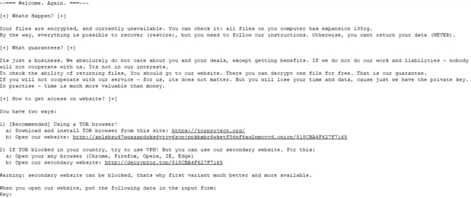
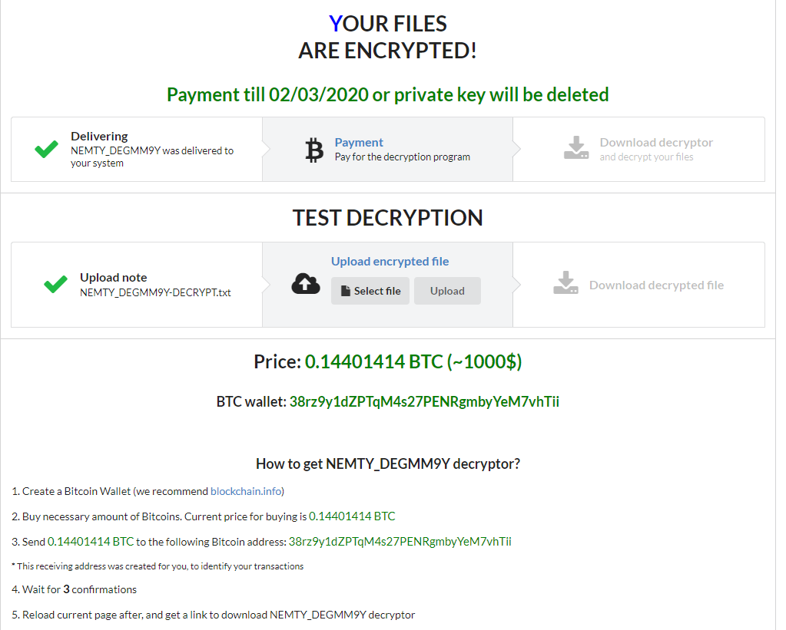
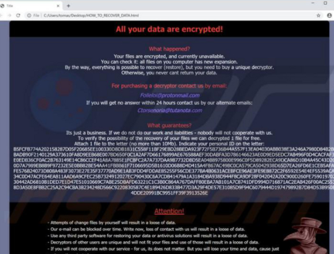
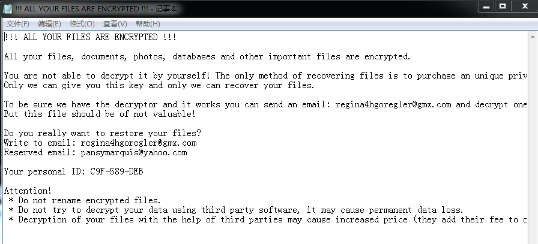

# 勒索病毒家族

*phobos*、*Globelmposter*、*Sodinokibi*、*Crysis*、*Buran*、*Devos*、*CryptoJoker*、*LockBit*、*Makop*、*Stop*、*Others*

https://zhuanlan.kanxue.com/article-10843.htm

## Makop勒索病毒
Makop勒索病毒最早于2020年年初被发现,此家族每次生成4个版本，按照有无调试信息可以分为带UI的测试环境版本和无UI的生产环境版本，按照加密顺序可以划分为快速加密版本和常规加密版本(常规版本针对特定后缀的文件如sqlite和doc等优先进行加密)。另外还有一个比较有意思的发现，就是此家族样本除了不加密自身加密的文件之外，还包含了“CARLOS”后缀，此后缀的样本在2020年2月左右出现过，两者存在强相关。

**加密和特征**
- 每30s生成新的随机AES密钥，全盘扫描一次未加密文件
- 使用内置硬编码RSA公钥加密1中提到的AES密钥
- 针对每个文件生成AES IV，用于加密文件数据
- 将2中被加密的AES和3中的AES IV写入文件尾部

**变种后缀**
```
    .makop;.shootlock;.CARLOS;.zes;.fai;.Hidden;.origami;.zbw;fireee;shootlock2;
```

**勒索信息**



**是否可解**
```
    虽然勒索病毒不会退出，但是由于每30s一次的AES密钥更新，内存中基本上不会存在解密所需的AES密钥，因此正常情况下不存在解密方法。
```

**防护建议：**
- 多台机器，不要使用相同的账号和口令
- 登录口令要有足够的长度和复杂性，并定期更换登录口令
- 重要资料的共享文件夹应设置访问权限控制，并进行定期备份
- 定期检测系统和软件中的安全漏洞，及时打上补丁。
- 定期到服务器检查是否存在异常。查看范围包括：
    a)是否有新增账户
    b) Guest是否被启用
    c) Windows系统日志是否存在异常
    d)杀毒软件是否存在异常拦截情况
- 安装安全防护软件，并确保其正常运行。
- 从正规渠道下载安装软件。
- 对不熟悉的软件，如果已经被杀毒软件拦截查杀，不要添加信任继续运行。


## GlobeImposter
GlobeImposter家族首次发现是在2017年5月左右，截至2020年仍然存在相关变种并且传播广泛，危害极大。

**加密流程和特征**
- 每个文件生成AES密钥，用于加密文件数据
- 本地随机生成RSA密钥对，公钥用于加密1中提到的随机AES密钥
- 每个样本都存在硬编码的RSA公钥，用于加密2中提到的随机RSA密钥对的私钥
- 加密完成后删除自身并退出

**变种后缀**
```
1.0版本：

Zeus666;Poseidon666;Apollo666;Artemis666;Ares666;Aphrodite666;Dionysus666;Persephone666;Hephaestus666;Hades666;


2.0版本：

Zeus865;.Hera865;.Poseidon865;.Hades865;.Hestia865;.Ares865;.Athene865;.Hermes865;.Hephaestus865;.Apollo865;.Aphrodite865;.Artemis865;

Zeus865-10;.Hera865-10;.Poseidon865-10;.Hades865-10;.Hestia865-10;.Ares865-10;.Athene865-10;.Hermes865-10;.Hephaestus865-10;.Apollo865-10;.Aphrodite865-10;.Artemis865-10;.Artemis865qq;

Zeus865-20;.Hera865-20;.Poseidon865-20;.Hades865-20;.Hestia865-20;.Ares865-20;.Athene865-20;.Hermes865-20;.Hephaestus865-20;.Apollo865-20;.Aphrodite865-20;.Artemis865-20;.Artemis865qq;.mrimrssmith
```

其他变种:

被加密文件后缀：Erenahen
黑客邮箱：Erenahen@cock.li、Kishemez@tutanota.com


**勒索信息**



**是否可解**
```
    因此正常情况下不存在解密方法。
```

**其他防护建议**
- 多台机器，不要使用相同的账号和口令
- 登录口令要有足够的长度和复杂性，并定期更换登录口令
- 重要资料的共享文件夹应设置访问权限控制，并进行定期备份
- 定期检测系统和软件中的安全漏洞，及时打上补丁。
- 定期到服务器检查是否存在异常。查看范围包括：
    a)是否有新增账户
    b) Guest是否被启用
    c) Windows系统日志是否存在异常
    d)杀毒软件是否存在异常拦截情况
- 安装安全防护软件，并确保其正常运行。
- 从正规渠道下载安装软件。
- 对不熟悉的软件，如果已经被杀毒软件拦截查杀，不要添加信任继续运行。


## CrySiS
CrySiS勒索病毒，又称Dharma，首次公开露面是在2016年左右，但是此家族样本的密钥曾在2017年5月被公布过，因此这个时间节点之前的样本可以解密，随后开始出现此勒索的变种，主要是通过RDP暴力破解的方式入侵并加密勒索。

**密流程和特征**
- 使用RC4算法解密出RSA公钥
- 使用RDTST读取CPU启动时间周期，使用RSA公钥的SHA1对获得的时间随机数进行更新得到256位AES密钥，用于加密文件
- 结合CPU启动周期得到16字节随机数，结合RSA公钥的SHA1对此值进行更新，得到随机的AES IV，用于加密文件
- 使用2和3中得到的密钥和IV对文件进行加密
- 使用硬编码RSA公钥加密步骤2中得到的AES密钥，将此加密后的结果和步骤3中生成的IV写入被加密文件

**变种后缀**
```
.Calum;.bat;.combo;.IDB;.New;.arrow;.bip;.BearUnpack;.java;.best;.ETH;.betta;.4k;.bgtx;.888;.bizer;.aa1;.bk666;.bkp;.bkpx;.brrr;.btc;.btix;.air;.carcn;.amber;.cccmn;.aqva;.CMB;.AUDIT;.cobra;.AUF;.com;.azero;.ms13;.myjob;.NWA;.plomb;.cry;.qbix;.crypt;.qwex;.docx;.RISK;.ETH;.santa;.stun;.tron;.fire;.USA;.frend;.vanss;.FUNNY;.video;.gamma;.waifu;.gate;.gdb;.wal;.gif;.wallet;.war;.KARLS;.xwx;.korea;.XXXXX;.ldpr;.like;.LOVE;.MERS;.monro;.adobe;.arena;.boost;.Back;.wallet;.bbc;.actin;.adage;..id-ACBBC279.[qbix@qq.com].qbix;.Calum;.wiki;.Dever;.harma;
```

https://bbs.360.cn/thread-15782297-1-1.html
**其他变种:**
黑客邮箱：recoverysql@protonmail.com
被加密文件后缀：ROGER


**勒索信息**



**是否可解**
```
    综上除非知道RSA私钥，否则无法解密。根据公开情报，在17年5月旧版勒索曾爆出万能密钥，因此该时间节点之前的版本可以解密。
    [CrySiS勒索函数特征](https://liuwx-1259310507.cos.ap-chengdu.myqcloud.com/kongbai/1/8.png)
    (Crysis-old版本能解密)
```


## Phobos
Phobos勒索软件家族与2016年出现的CrySIS/Dharma勒索软件家族所使用的加密方式、部分代码段、勒索信外观与内容，以及用于加密文件的命名方式都较为相似。

但不排除为同一作者或Phobos勒索软件攻击者购买、利用CrySIS/Dharma勒索软件相关代码的情况

**加密流程和特征**
- 使用RC4算法解密出RSA公钥
- 使用RDTST读取CPU启动时间周期，使用RSA公钥的SHA1对获得的时间随机数进行更新得到256位AES密钥，用于加密文件
- 结合CPU启动周期得到16字节随机数，结合RSA公钥的SHA1对此值进行更新，得到随机的AES IV，用于加密文件
- 使用2和3中得到的密钥和IV对文件进行加密
- 使用硬编码RSA公钥加密步骤2中得到的AES密钥，将此加密后的结果和步骤3中生成的IV写入被加密文件

**变种后缀**
```
    .phobos;.phobos;.help;.deal;.Caleb;.wiki;.dewar;devil;Devos;.eight;.eking;
```

**其他变种:**
.JDM


**勒索信息**



**是否可解**
```
    综上除非知道RSA私钥，否则在正常情况下无法解密
```


## Sodinokibi
Sodinokibi勒索病毒在国内首次被发现于2019年4月份,2019年5月24日首次在意大利被发现，
使用了RDP攻击的方式进行传播感染，这款病毒被称为GandCrab勒索病毒的接班人，

**加密流程和特征**
- 生成一组密钥对，公钥直接存储在注册表中
- 使用攻击者在配置文件中的公钥加密1中生成的私钥，并将其存储在注册表中
- 使用软件的硬编码公钥加密1中生成的私钥，并将其存储在注册表中
- 针对每个文件使用基于1中公钥生成的Salsa20流密码加密文件
- 主动清理内存，防止RAM扫描

**变种后缀**
```
    随机后缀
```

**勒索信息**



**是否可解**
```
    按照技术手段来说无法解密，网络上报道出售的解密工具很可能包含了作者的RSA的私钥，但是根据网络消息，该工具已经出售但并未公开。
```


## Stop
该勒索病毒从2018年2月活跃至今，主要利用了合作网站，破解软件等或捆绑在激活工具进行传播，目前已有几十种变种。

**加密流程和特征**
- 计算MAC地址MD5，作为唯一标识发送到CC，获取RSA公钥，用于加密salsa密钥
- 如果连接远程CC失败，则直接使用内置硬编码RSA公钥，用于加密salsa密钥
- 针对每个文件生成不同UUID，转化为36字节字符串，其中前32字节作为salsa20的密钥，前8字节作为IV，用于对文件加密
- 使用salsa20对文件加密，其中文件前五个字节不加密，加密后写入文件
- 使用1或2种的RSA公钥加密3中生成的UUID，追加到文件尾部

**变种后缀**
```
    .cetori;.seto;.mtogas;/nasoh;.bacro;.pedro;.vesrato;.nuksus;.vesrato;masodas;.cetori;.stare;.carote;.coharos;.gero;.gese;.geno;.seto;.cdr;.shariz;.peta;.moka;nesa;.kasp;
```

**勒索信息**


**是否可解**
```
    从技术手段上来说，不存在解密手段。
    但是早期部分病毒版本由于其服务器生成密钥接口存在缺陷，当第一次请求接口时，服务器生成返回新的Key数据，而当再次访问密钥生成接口，服务器则会把该mac请求生成过的Key直接返回，针对此bug可拿到密钥实现解密。
    病毒使用Key生成接口失活情况下，病毒会使用离线Key进行加密，在该情况下，配合公布的大量离线解密密钥，大概率可以实现解密。
```


## Maze
Maze勒索病毒，又称Chacha勒索病毒，2019年5月份由Malwarebytes安全研究员首次发现，使用Fallout漏洞利用工具包通过伪装成合法加密货币交换应用程序的假冒站点进行分发传播。

**加密流程和特征**
- 本地生成RSA公私钥对，
- 生成随机32字节key，8字节Nonce值，集合chacha算法加密1中生成的RSA私钥
- 使用内置硬编码RSA公钥加密2中使用的随机key和Nonce值
- 针对每个文件生成随机key和Nonce值，结合chacha对称加密算法加密文件
- 利用1中生成的RSA公钥对4中生成的随机key和Nonce值进行加密并拼接到文件尾部
- 将2中被加密之后的RSA私钥、3中被加密的key和Nonce值以及部分用户元数据进行base64，写入勒索提示信息

**是否可解**
```
    从技术手段上讲暂无解密方案，暂时也没有获取到公开的密钥信息，因此在正常情况下无法解密。
```


## Nemty
NEMTY勒索病毒是一款新型流行勒索病毒，首次发现于2019年8月21号，8月24号国外安全研究人员公布了此勒索病毒的相关信息，随后这款勒索病毒快速发展，在不到半年的时间里，已经发展到了最新的2.5版本，目前这款勒索病毒主要在韩国等地区非常活跃

**加密流程和特征**
- 本地随机生成RSA密钥对，用于对AES密钥加密
- 本地生成随机AES密钥，用于加密文件
- 使用2中生成的AES密钥对文件内容进行加密
- 对2中随机生成的AES密钥进行BASE64编码，然后使用1中生成的随机RSA公钥加密此编码，写入文件尾部
- 对1中生成的RSA私钥进行base64编码，然后使用硬编码的RSA公钥对此编码进行加密，写入到勒索信中

**变种后缀**
```
    .NEMTY_<random{7}>;._NEMTY_random_7个随机字符
```

**勒索信息**



**是否可解**
```
    从技术手段上来讲不存在解密手段，但是该样本早期对Windows Blob(密钥离线存储结构体)的使用存在一定问题，因此早期版本可以解密。
```


## Medusalocker
Medusalocker勒索病毒家族在2019年10月左右开始进行传播，已知的传播手段主要是RDP爆破后手动投毒。

**加密流程和特征**
- 本地生成全局随机AES密钥，用于对所有文件进行加密
- 使用硬编码的RSA公钥对1中生成的随机AES密钥进行加密，将被加密的AES密钥数据写入文件尾部
- 从技术手段上来说不存在解密方案，也没有公开黑客的RSA私钥，因此无法解密。


**变种后缀**
```
    .encrypted;.skynet;.ReadTheInstructions;ReadInstructions;
```

**勒索信息**




**是否可解**
```
    从技术手段上来讲不存在解密手段，也没有公开黑客的RSA私钥，因此无法解密。
```


## Buran勒索
Buran勒索病毒自2019年9月开始，在国内开始进行攻击狩猎行动。该病毒主要借助垃圾邮件、弱口令爆破两种方式传播。早期版本加密文件后会添加扩展后缀.Buran，新版本病毒加密文件后会添加随机扩展后缀，同时留下名为!!! ALL YOUR FILES ARE ENCRYPTED !!!.TXT的勒索信，

**变种后缀**
```
    Personal ID（文件加密后缀与勒索信中的Personal ID一样）
```

**勒索信息**



**是否可解**
```
    Buran勒索病毒家族，暂时无解
```


三、安全建议
企业用户：

1、尽量关闭不必要的端口，如：445、135，139等，对3389，5900等端口可进行白名单配置，只允许白名单内的IP连接登陆。

2、尽量关闭不必要的文件共享，如有需要，请使用ACL和强密码保护来限制访问权限，禁用对共享文件夹的匿名访问。

3、采用高强度的密码，避免使用弱口令密码，并定期更换密码。建议服务器密码使用高强度且无规律密码，并且强制要求每个服务器使用不同密码管理。

4、对没有互联需求的服务器/工作站内部访问设置相应控制，避免可连外网服务器被攻击后作为跳板进一步攻击其他服务器。

5、对重要文件和数据（数据库等数据）进行定期非本地备份。

6、教育终端用户谨慎下载陌生邮件附件，若非必要，应禁止启用Office宏代码。

7、在终端/服务器部署专业安全防护软件，